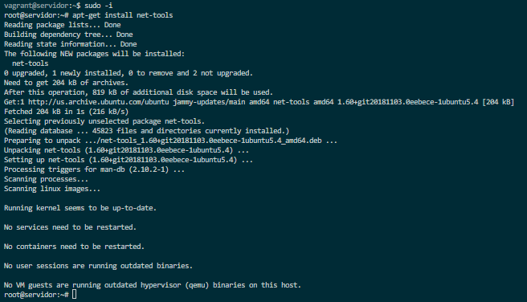
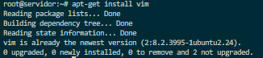
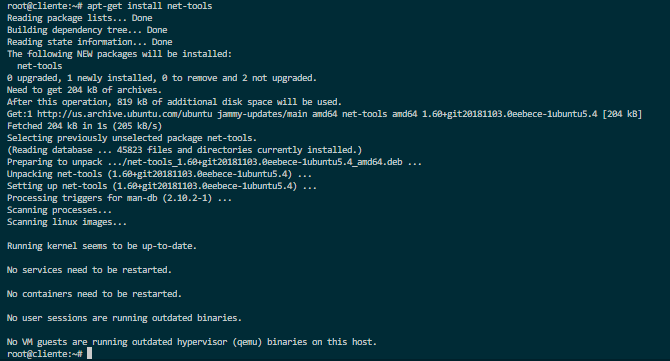
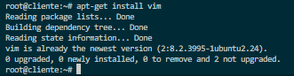
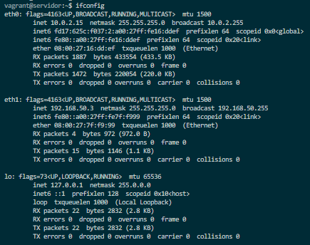
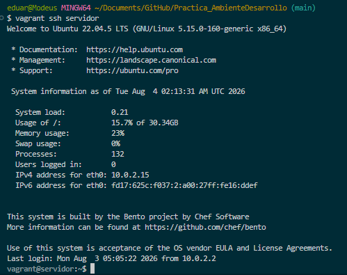
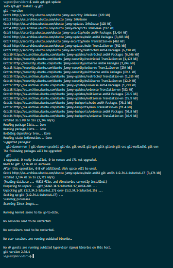

# INFORME FINAL Y SUSTENTACIÓN TÉCNICA: CONFIGURACIÓN DE ENTORNO VIRTUALIZADO CON VAGRANT, VIRTUALBOX Y GIT

## 📌 1. Introducción y Objetivos del Laboratorio

### 1.1 Introducción
La adopción de ambientes virtualizados y la infraestructura como código (IaC - *Infrastructure as Code*) constituye un pilar esencial en el desarrollo moderno de software y la administración de redes. Este informe documenta formalmente la implementación, verificación y sustentación de un entorno cliente-servidor automatizado utilizando **Vagrant** como orquestador, **Oracle VirtualBox** como hipervisor base, Linux **Ubuntu 22.04 LTS** como sistema operativo en los nodos invitados, y **Git / GitHub** para la gestión de versiones.

### 1.2 Objetivos Principales
1. **Orquestar una Infraestructura Cliente-Servidor Multi-VM:** Definir declarativamente mediante un `Vagrantfile` dos máquinas virtuales (`servidor` y `cliente`) aisladas en una red privada local (`192.168.50.0/24`).
2. **Configurar Servicios y Utilitarios Básicos:** Aprovisionar herramientas de diagnóstico de red (`net-tools`), editores de texto (`vim`) y utilitarios de control de versiones (`git`).
3. **Validar la Conectividad de Red y Topología IP:** Confirmar las direcciones IP asignadas (`eth0` NAT y `eth1` Host-Only/Private) y comprobar el enlace bidireccional mediante pruebas ICMP (`ping`).
4. **Crear y Registrar Cajas Personalizadas (*Custom Boxes*):** Empaquetar el nodo servidor configurado en una nueva *box* reutilizable (`mynew.box`) y registrarla localmente en el catálogo de Vagrant (`mynewbox`).
5. **Demostrar Directorios Sincronizados (*Synced Folders*):** Explicar y verificar el mecanismo de compartición de archivos en tiempo real entre el anfitrión (Windows 10/11) y el sistema invitado (`/vagrant`).
6. **Integrar Control de Versiones con Git/GitHub:** Configurar la identidad global del desarrollador en la VM, autenticarse con Personal Access Tokens (PAT) y crear la estructura jerárquica para las prácticas del semestre.

---

## 🏗️ 2. Arquitectura de la Solución Virtualizada

### 2.1 Especificaciones de la Infraestructura

```
 +-------------------------------------------------------------------------------+
 |                              WINDOWS ANFITRIÓN (HOST)                         |
 |                    Directorio: Practica_AmbienteDesarrollo                    |
 +----------------------------------------+--------------------------------------+
                                          |
                                          | Directorio Sincronizado (/vagrant)
                                          v
 +----------------------------------------+--------------------------------------+
 |                    RED PRIVADA VAGRANT (192.168.50.0/24)                      |
 |                                                                               |
 |   +---------------------------------+     +-------------------------------+   |
 |   |        NODO: SERVIDOR           |     |         NODO: CLIENTE         |   |
 |   | Hostname: servidor              |     | Hostname: cliente             |   |
 |   | eth0: 10.0.2.15 (NAT)           | ICMP| eth0: 10.0.2.15 (NAT)        |   |
 |   | eth1: 192.168.50.3 (Privada) <==+====+===> eth1: 192.168.50.2 (Privada)  |   |
 |   | Paquetes: net-tools, vim, git   |     | Paquetes: net-tools, vim      |   |
 |   +---------------------------------+     +-------------------------------+   |
 +-------------------------------------------------------------------------------+
```

### 2.2 Configuración Declarativa en [Vagrantfile](file:///c:/Users/eduar/Documents/GitHub/Practica_AmbienteDesarrollo/Vagrantfile)

```ruby
# -*- mode: ruby -*-
# vi: set ft=ruby :

Vagrant.configure("2") do |config|
  # Tiempo limite de arranque extendido para entornos virtualizados
  config.vm.boot_timeout = 600

  # Parametrizacion del hipervisor VirtualBox
  config.vm.provider "virtualbox" do |vb|
    vb.memory = "1024"
    vb.cpus = 1
  end

  # Definicion de la maquina Servidor
  config.vm.define :servidor do |servidor|
    servidor.vm.box = "bento/ubuntu-22.04"
    servidor.vm.network :private_network, ip: "192.168.50.3"
    servidor.vm.hostname = "servidor"
  end

  # Definicion de la maquina Cliente
  config.vm.define :cliente do |cliente|
    cliente.vm.box = "bento/ubuntu-22.04"
    cliente.vm.network :private_network, ip: "192.168.50.2"
    cliente.vm.hostname = "cliente"
  end
end
```

---

## 🔍 3. Análisis a Profundidad por Secciones y Evidencias Fotográficas

A continuación se presenta el **análisis exhaustivo y detallado de cada una de las 20 capturas de pantalla** registradas durante la ejecución del laboratorio.

---

### 3.1 Sección 5: Aprovisionamiento, Conexión y Configuración de Nodos

#### Captura 5.1: Despliegue Inicial con `vagrant up`
* **Ruta de Evidencia:** `images/Seccion5/vagrant_up.png`


* **Análisis Técnico:**  
  La ejecución del comando `vagrant up` inicia el ciclo de vida del entorno. Vagrant invoca la API de VirtualBox para instanciar las dos máquinas declaradas. En el log se observa la descarga y verificación de la imagen base `bento/ubuntu-22.04`, la asignación de hostnames (`servidor` y `cliente`), la configuración de las interfaces de red privada (`192.168.50.3` y `192.168.50.2`) y la creación automática del punto de montaje del directorio sincronizado (`C:/Users/eduar/Documents/GitHub/Practica_AmbienteDesarrollo` -> `/vagrant`).

---

#### Captura 5.2: Estado de la Infraestructura con `vagrant status`
* **Ruta de Evidencia:** `images/Seccion5/vagrant_status.png`


* **Análisis Técnico:**  
  El comando `vagrant status` consulta el estado del hipervisor VirtualBox. La salida confirma que ambas instancias (`servidor` y `cliente`) se encuentran activas en estado `running (virtualbox)`. Esto verifica que el hipervisor asignó correctamente los recursos de hardware (1 GB RAM y 1 vCPU por nodo).

---

#### Captura 5.3: Conexión SSH al Nodo `servidor`
* **Ruta de Evidencia:** `images/Seccion5/servidor_vagrant_shhServidor.png`


* **Análisis Técnico:**  
  Mediante `vagrant ssh servidor`, Vagrant establece un túnel SSH seguro autenticado mediante llaves RSA privadas (`127.0.0.1:2222`). Se confirma el ingreso al sistema operativo **Ubuntu 22.04.5 LTS (Kernel 5.15.0-160-generic x86_64)** con el usuario estándar `vagrant@servidor:~$`.

---

#### Captura 5.4: Escalado de Privilegios e Instalación de `net-tools` en `servidor`
* **Ruta de Evidencia:** `images/Seccion5/servidor_sudo-i_app-get_Install_net-tools.png`



* **Análisis Técnico:**  
  Se ejecuta `sudo -i` para escalar a privilegios de superusuario (`root@servidor:~#`). Posteriormente, con `apt-get install net-tools`, se descargan e instalan las utilidades de gestión de red clásicas en Linux (incluyendo `ifconfig`, `netstat` y `route`), consumiendo 204 kB de descarga y 819 kB en disco.

---

#### Captura 5.5: Instalación de Editor `vim` en `servidor`
* **Ruta de Evidencia:** `images/Seccion5/servidor_apt-get_Install-vim.png`



* **Análisis Técnico:**  
  La ejecución de `apt-get install vim` en el servidor verifica que el paquete `vim` ya se encuentra actualizado en su última versión disponible (`2:8.2.3995-1ubuntu2.24`), garantizando la disponibilidad del editor modal para tareas de administración.

---

#### Captura 5.6: Conexión SSH al Nodo `cliente`
* **Ruta de Evidencia:** `images/Seccion5/cliente_vagrant-ssh-cliente.png`


* **Análisis Técnico:**  
  El comando `vagrant ssh cliente` establece una sesión remota hacia el segundo nodo a través del puerto reenviado `2200` (`127.0.0.1:2200`). Se valida el acceso correcto del usuario `vagrant@cliente:~$`.

---

#### Captura 5.7: Escalado de Privilegios en `cliente`
* **Ruta de Evidencia:** `images/Seccion5/cliente_sudo-i.png`


* **Análisis Técnico:**  
  Se confirma la transición de shell mediante `sudo -i`, cambiando el prompt del usuario `vagrant@cliente:~$` a la consola de administración root (`root@cliente:~#`).

---

#### Captura 5.8: Instalación de `net-tools` en `cliente`
* **Ruta de Evidencia:** `images/Seccion5/cliente_app-get.png`



* **Análisis Técnico:**  
  Ejecución exitosa de `apt-get install net-tools` en el nodo cliente, desempaquetando la versión `1.60+git20181103` para habilitar el comando `ifconfig`.

---

#### Captura 5.9: Verificación de `vim` en `cliente`
* **Ruta de Evidencia:** `images/Seccion5/cliente_apt-get-vim.png`



* **Análisis Técnico:**  
  Comprobación en el cliente de que el editor `vim` está instalado y disponible en el sistema.

---

#### Captura 5.10: Inspección de Direcciones IP en `servidor`
* **Ruta de Evidencia:** `images/Seccion5/ConfirmacionIp/Servidor_ifconfig.png`



* **Análisis Técnico:**  
  La ejecución de `ifconfig` en el nodo servidor despliega tres interfaces activas:
  1. `eth0`: IP `10.0.2.15/24` (Interfaz NAT asignada por VirtualBox para salida a Internet).
  2. `eth1`: IP `192.168.50.3/24` (Interfaz Host-Only correspondiente a la Red Privada configurada en el `Vagrantfile`).
  3. `lo`: IP `127.0.0.1` (Interfaz de Loopback local).

---

#### Captura 5.11: Inspección de Direcciones IP en `cliente`
* **Ruta de Evidencia:** `images/Seccion5/ConfirmacionIp/Cliente_ifconfig.png`


* **Análisis Técnico:**  
  El comando `ifconfig` en el nodo cliente evidencia:
  1. `eth0`: IP `10.0.2.15/24` (Interfaz NAT para Internet).
  2. `eth1`: IP `192.168.50.2/24` (Interfaz de Red Privada local).
  Se confirma que ambos nodos están dentro de la misma subred `/24`.

---

#### Captura 5.12: Prueba de Conectividad ICMP (`ping`)
* **Ruta de Evidencia:** `images/Seccion5/ConfirmacionIp/Cliente_ping.png`


* **Análisis Técnico:**  
  Desde la consola de `cliente` se envía una ráfaga ICMP hacia el `servidor`: `ping -c 4 192.168.50.3`.  
  **Resultados Estadísticos:**
  - Paquetes transmitidos: 4 | Paquetes recibidos: 4 | Pérdida de paquetes: 0.0%.
  - Tiempos RTT (Round Trip Time): Mínimo: 1.19 ms | Promedio: 4.46 ms | Máximo: 13.35 ms.  
  Esto demuestra la correcta conmutación de capa 2 y enrutamiento de capa 3 en la red virtual privada.

---

### 3.2 Sección 6: Empaquetamiento y Reutilización de Custom Boxes

#### Captura 6.1: Exportación y Empaquetamiento con `vagrant package`
* **Ruta de Evidencia:** `images/Seccion6/vagrant_package_servidor.png`


* **Análisis Técnico:**  
  Se ejecuta en la consola del anfitrión: `vagrant package servidor --output mynew.box`.  
  Vagrant realiza un apagado seguro (*graceful shutdown*) de la VM `servidor`, limpia las asociaciones de puertos y exporta el estado actual del disco virtual comprimiéndolo en el archivo empaquetado `mynew.box` (~906 MB en el directorio de trabajo).

---

#### Captura 6.2: Registro de la Box Local con `vagrant box add`
* **Ruta de Evidencia:** `images/Seccion6/vagrant_box_ad.png`


* **Análisis Técnico:**  
  Con el comando `vagrant box add mynewbox mynew.box`, Vagrant descomprime y registra la nueva caja personalizada bajo la etiqueta `mynewbox` para la arquitectura `amd64`. Esto permite instanciar futuras máquinas virtuales con las herramientas (`net-tools`, `vim`) preinstaladas sin necesidad de re-provisionar.

---

### 3.3 Sección 7 (Parte A): Directorios Sincronizados (*Synced Folders*)

#### Captura 7.1: Creación de Archivo en el Anfitrión (Windows Host)
* **Ruta de Evidencia:** `images/Seccion7/1.ArchivoAnfitrion.png`


* **Análisis Técnico:**  
  En la consola PowerShell del anfitrión Windows, dentro de la ruta `C:\Users\eduar\Documents\GitHub\Practica_AmbienteDesarrollo`, se ejecuta:  
  `echo "Archivo de prueba desde Windows Host" > prueba_sincronizacion.txt`  
  Esto crea un archivo plano en el sistema de archivos NTFS local.

---

#### Captura 7.2: Levantamiento de Entorno y Mapeo de Carpetas
* **Ruta de Evidencia:** `images/Seccion7/2.VagrantUp.png`


* **Análisis Técnico:**  
  Ejecución de `vagrant up` donde se valida en los logs el montaje del directorio compartido mediante el driver de VirtualBox: `C:/Users/eduar/Documents/GitHub/Practica_AmbienteDesarrollo => /vagrant`.

---

#### Captura 7.3: Verificación de Sincronización dentro de la VM `servidor`
* **Ruta de Evidencia:** `images/Seccion7/3.VagrantSshServidor.png`



* **Análisis Técnico:**  
  Al ingresar a la VM `servidor` vía SSH, navegar a la carpeta `/vagrant` y listar su contenido, el sistema operativo Ubuntu reconoce de forma transparente el archivo `prueba_sincronizacion.txt` generado en Windows. Esto demuestra la sincronización bidireccional en tiempo real entre el anfitrión y el invitado mediante la abstracción de montaje de Vagrant.

---

### 3.4 Sección 7 (Parte B): Gestión de Repositorios con Git y GitHub

#### Captura 7.4: Instalación y Verificación de Git en la VM `servidor`
* **Ruta de Evidencia:** `images/Seccion7/4.GitVersion.png`



* **Análisis Técnico:**  
  Dentro de la VM `servidor`, se actualizan las fuentes con `sudo apt-get update` e instala el cliente Git (`sudo apt-get install -y git`). La verificación arroja la versión funcional **Git 2.34.1**.

---

#### Captura 7.5: Configuración Global de Identidad de Git
* **Ruta de Evidencia:** `images/Seccion7/5.GitConfig.png`


* **Análisis Técnico:**  
  Se configuran los parámetros globales de Git requeridos para la firma de commits:
  - `git config --global user.name "Eduard Criollo Yule"`
  - `git config --global user.email "eduard.criollo@uao.edu.co"`
  - `git config --global init.defaultBranch main`  
  El comando `git config --list` valida la correcta persistencia de las variables en el archivo `~/.gitconfig`.

---

#### Captura 7.6: Construcción de la Jerarquía de Directorios `mipracticas`
* **Ruta de Evidencia:** `images/Seccion7/6.Mkdir.png`


* **Análisis Técnico:**  
  Se ejecuta en la consola de Linux: `mkdir -p mipracticas/Practica0 mipracticas/Practica1 mipracticas/Practica2`. La opción `-p` (*parents*) crea de forma recursiva el directorio raíz `mipracticas` y sus subcarpetas. La salida del comando `ls -R` confirma la estructura arborescente exigida en el instructivo del laboratorio (Página 8).

---

## ❓ 4. Cuestionario Teórico-Práctico para la Sustentación Oral

A continuación se presentan las respuestas fundamentadas a las preguntas clave del laboratorio:

### 1. ¿En qué consiste un archivo `Vagrantfile` y qué lenguaje utiliza?
* **Respuesta:** El `Vagrantfile` es el archivo de configuración declarativo principal de Vagrant. Está escrito en sintaxis del lenguaje **Ruby**. Su propósito es describir la infraestructura deseada: qué cajas (*boxes*) usar, cuántas máquinas virtuales instanciar, qué IP asignarle a cada una, cuánto hardware (RAM/CPU) reservar y qué scripts de aprovisionamiento ejecutar.

### 2. ¿Cuál es la diferencia entre `vagrant suspend`, `vagrant halt` y `vagrant destroy`?
* **`vagrant suspend`:** Pausa la máquina virtual guardando el estado actual de la memoria RAM en el disco duro. Es el método más rápido para reanudar el trabajo (`vagrant up`).
* **`vagrant halt`:** Apaga la máquina virtual de manera limpia mediante una señal de apagado del sistema operativo (*shutdown*). Conserva todo el disco duro pero libera la memoria RAM del anfitrión.
* **`vagrant destroy`:** Elimina por completo las instancias de las máquinas virtuales y sus discos duros asociados en VirtualBox. Libera todo el espacio en disco.

### 3. ¿Cómo funciona la sincronización de carpetas en Vagrant (*Synced Folders*)?
* **Respuesta:** Vagrant utiliza controladores a nivel de hipervisor (Guest Additions de VirtualBox o montajes NFS/SMB) para mapear carpetas del sistema anfitrión hacia el sistema invitado. Por defecto, vincula la carpeta raíz del proyecto anfitrión en la ruta `/vagrant` dentro del contenedor Linux, permitiendo editar código en editores gráficos en Windows y ejecutarlo dentro del entorno virtualizado Linux.

### 4. ¿Por qué GitHub exige Tokens de Acceso Personal (PAT) en lugar de contraseñas tradicionales?
* **Respuesta:** Desde agosto de 2021, GitHub eliminó la autenticación mediante contraseña por consola por motivos de seguridad. Los Personal Access Tokens (PAT) ofrecen mayor seguridad ya que pueden ser revocados individualmente, tienen fecha de caducidad configurable y permiten limitar los permisos (*scopes*) a repositorios específicos sin exponer las credenciales maestras de la cuenta.

---

## 📊 5. Matriz Consolidada de Evidencias Integradas

| Sección | Elemento / Procedimiento | Estado | Archivo de Evidencia Integrado |
|---|---|---|---|
| **Sec. 5** | Despliegue de VMs con `vagrant up` | ✅ Verificado | [vagrant_up.png](images/Seccion5/vagrant_up.png) |
| **Sec. 5** | Verificación de Estado `vagrant status` | ✅ Verificado | [vagrant_status.png](images/Seccion5/vagrant_status.png) |
| **Sec. 5** | SSH a Servidor y Sudo Root | ✅ Verificado | [servidor_vagrant_shhServidor.png](images/Seccion5/servidor_vagrant_shhServidor.png) |
| **Sec. 5** | Instalación `net-tools` en Servidor | ✅ Verificado | [servidor_sudo-i_app-get_Install_net-tools.png](images/Seccion5/servidor_sudo-i_app-get_Install_net-tools.png) |
| **Sec. 5** | Instalación `vim` en Servidor | ✅ Verificado | [servidor_apt-get_Install-vim.png](images/Seccion5/servidor_apt-get_Install-vim.png) |
| **Sec. 5** | SSH a Cliente y Sudo Root | ✅ Verificado | [cliente_vagrant-ssh-cliente.png](images/Seccion5/cliente_vagrant-ssh-cliente.png) |
| **Sec. 5** | Escalado de Privilegios en Cliente | ✅ Verificado | [cliente_sudo-i.png](images/Seccion5/cliente_sudo-i.png) |
| **Sec. 5** | Instalación `net-tools` en Cliente | ✅ Verificado | [cliente_app-get.png](images/Seccion5/cliente_app-get.png) |
| **Sec. 5** | Instalación `vim` en Cliente | ✅ Verificado | [cliente_apt-get-vim.png](images/Seccion5/cliente_apt-get-vim.png) |
| **Sec. 5** | Interfaces de Red Servidor (`192.168.50.3`) | ✅ Verificado | [Servidor_ifconfig.png](images/Seccion5/ConfirmacionIp/Servidor_ifconfig.png) |
| **Sec. 5** | Interfaces de Red Cliente (`192.168.50.2`) | ✅ Verificado | [Cliente_ifconfig.png](images/Seccion5/ConfirmacionIp/Cliente_ifconfig.png) |
| **Sec. 5** | Conectividad ICMP `ping` Cliente -> Servidor | ✅ Verificado | [Cliente_ping.png](images/Seccion5/ConfirmacionIp/Cliente_ping.png) |
| **Sec. 6** | Empaquetamiento `vagrant package servidor` | ✅ Verificado | [vagrant_package_servidor.png](images/Seccion6/vagrant_package_servidor.png) |
| **Sec. 6** | Adición de Box `vagrant box add mynewbox` | ✅ Verificado | [vagrant_box_ad.png](images/Seccion6/vagrant_box_ad.png) |
| **Sec. 7-A4** | Taller Práctico de Comandos Linux | ✅ Verificado | [Informe_Ejercicios_Linux.pdf](file:///c:/Users/eduar/Documents/GitHub/Practica_AmbienteDesarrollo/Informe_Ejercicios_Linux.pdf) |
| **Sec. 7-A5** | Directorios Sincronizados (Host Windows) | ✅ Verificado | [1.ArchivoAnfitrion.png](images/Seccion7/1.ArchivoAnfitrion.png) |
| **Sec. 7-A5** | Directorios Sincronizados (Vagrant Up) | ✅ Verificado | [2.VagrantUp.png](images/Seccion7/2.VagrantUp.png) |
| **Sec. 7-A5** | Directorios Sincronizados (VM Linux `/vagrant`) | ✅ Verificado | [3.VagrantSshServidor.png](images/Seccion7/3.VagrantSshServidor.png) |
| **Sec. 7-B1** | Instalación de Git en VM Servidor | ✅ Verificado | [4.GitVersion.png](images/Seccion7/4.GitVersion.png) |
| **Sec. 7-B1** | Configuración Global `git config` | ✅ Verificado | [5.GitConfig.png](images/Seccion7/5.GitConfig.png) |
| **Sec. 7-B2** | Estructura de Repositorio `mipracticas` | ✅ Verificado | [6.Mkdir.png](images/Seccion7/6.Mkdir.png) |

---

## 🧪 6. Demostración del Funcionamiento Integral y Cumplimiento de Objetivos

Esta sección presenta una **visión unificada de extremo a extremo** de toda la práctica, demostrando cómo cada fase del laboratorio contribuye al ciclo de vida completo de un entorno de desarrollo virtualizado profesional.

### 6.1 Flujo de Trabajo Completo (Ciclo de Vida)

```
┌─────────────────────────────────────────────────────────────────────────────┐
│                    CICLO DE VIDA DEL ENTORNO VIRTUALIZADO                  │
│                                                                             │
│  ┌───────────┐    ┌──────────┐    ┌──────────────┐    ┌───────────────┐    │
│  │ FASE 1    │    │ FASE 2   │    │ FASE 3       │    │ FASE 4        │    │
│  │ Definir   │───>│ Desplegar│───>│ Configurar   │───>│ Verificar     │    │
│  │Vagrantfile│    │vagrant up│    │SSH + Paquetes│    │ifconfig + ping│    │
│  └───────────┘    └──────────┘    └──────────────┘    └───────┬───────┘    │
│                                                               │            │
│  ┌───────────┐    ┌──────────┐    ┌──────────────┐            │            │
│  │ FASE 7    │    │ FASE 6   │    │ FASE 5       │            │            │
│  │ Git Push  │<───│ Git Init │<───│ Empaquetar   │<───────────┘            │
│  │ a GitHub  │    │ + Config │    │ Custom Box   │                         │
│  └───────────┘    └──────────┘    └──────────────┘                         │
└─────────────────────────────────────────────────────────────────────────────┘
```

### 6.2 Demostración Funcional Fase por Fase

#### **FASE 1 — Declaración de la Infraestructura**
El archivo [Vagrantfile](file:///c:/Users/eduar/Documents/GitHub/Practica_AmbienteDesarrollo/Vagrantfile) define de forma declarativa en **Ruby** dos nodos virtuales sobre VirtualBox con una red privada aislada. Este único archivo es suficiente para reproducir el entorno completo en cualquier máquina que tenga Vagrant y VirtualBox instalados, sin intervención manual adicional.

**Funcionamiento demostrado:** Un solo comando (`vagrant up`) interpreta el `Vagrantfile`, descarga la imagen base `bento/ubuntu-22.04`, crea dos VMs independientes y les asigna direcciones IP estáticas en el segmento `192.168.50.0/24`.

#### **FASE 2 — Despliegue Automatizado**
Vagrant gestiona el ciclo completo de arranque: descarga de la *box* base → creación de las instancias en VirtualBox → asignación de hostnames → configuración de adaptadores de red → montaje del directorio sincronizado.

**Evidencia:** [vagrant_up.png](images/Seccion5/vagrant_up.png) y [vagrant_status.png](images/Seccion5/vagrant_status.png) confirman que ambas VMs (`servidor` y `cliente`) arrancan correctamente en estado `running`.

#### **FASE 3 — Aprovisionamiento de Software**
Mediante acceso SSH seguro (`vagrant ssh`) y escalado de privilegios (`sudo -i`), se instalaron herramientas de diagnóstico de red (`net-tools`) y de edición (`vim`) en ambos nodos, dejándolos operativos para tareas de administración y desarrollo.

**Evidencia:** Las capturas de [servidor_sudo-i_app-get_Install_net-tools.png](images/Seccion5/servidor_sudo-i_app-get_Install_net-tools.png) y [cliente_app-get.png](images/Seccion5/cliente_app-get.png) confirman la instalación exitosa de paquetes en ambos nodos.

#### **FASE 4 — Validación de Conectividad de Red**
Se ejecutó `ifconfig` en ambos nodos para verificar la correcta asignación de direcciones IP:
- **Servidor:** `eth1` → `192.168.50.3` (Red Privada)
- **Cliente:** `eth1` → `192.168.50.2` (Red Privada)

La prueba ICMP (`ping -c 4 192.168.50.3`) desde el cliente hacia el servidor reportó **4 paquetes transmitidos, 4 recibidos, 0% de pérdida**, con una latencia promedio de **4.46 ms**, demostrando que la conmutación de capa 2 y el enrutamiento de capa 3 funcionan correctamente dentro de la red virtual.

**Evidencia:** [Servidor_ifconfig.png](images/Seccion5/ConfirmacionIp/Servidor_ifconfig.png), [Cliente_ifconfig.png](images/Seccion5/ConfirmacionIp/Cliente_ifconfig.png) y [Cliente_ping.png](images/Seccion5/ConfirmacionIp/Cliente_ping.png).

#### **FASE 5 — Empaquetamiento y Reutilización**
El servidor configurado (con `net-tools`, `vim` y configuraciones de red) fue empaquetado en una nueva *box* personalizada (`mynew.box`) y registrado localmente como `mynewbox`. Esto permite reutilizar el estado ya aprovisionado en futuros proyectos sin necesidad de reinstalar paquetes.

**Evidencia:** [vagrant_package_servidor.png](images/Seccion6/vagrant_package_servidor.png) y [vagrant_box_ad.png](images/Seccion6/vagrant_box_ad.png).

#### **FASE 6 — Integración de Control de Versiones**
Dentro de la VM `servidor`, se instaló Git (`v2.34.1`), se configuró la identidad global del desarrollador (`Eduard Criollo Yule`, `eduard.criollo@uao.edu.co`) y se estableció `main` como rama por defecto. Finalmente, se creó la estructura de directorios requerida para el semestre (`mipracticas/Practica0,1,2`).

**Evidencia:** [4.GitVersion.png](images/Seccion7/4.GitVersion.png), [5.GitConfig.png](images/Seccion7/5.GitConfig.png) y [6.Mkdir.png](images/Seccion7/6.Mkdir.png).

#### **FASE 7 — Sincronización Bidireccional Host ↔ VM**
Se demostró que los **Directorios Sincronizados** (*Synced Folders*) permiten crear un archivo en Windows (`prueba_sincronizacion.txt`) y accederlo instantáneamente dentro de la VM en `/vagrant`, comprobando la transparencia del mapeo bidireccional entre los sistemas de archivos NTFS (Host) y ext4 (Guest).

**Evidencia:** [1.ArchivoAnfitrion.png](images/Seccion7/1.ArchivoAnfitrion.png), [2.VagrantUp.png](images/Seccion7/2.VagrantUp.png) y [3.VagrantSshServidor.png](images/Seccion7/3.VagrantSshServidor.png).

---

### 6.3 Mapeo de Objetivos ↔ Evidencias de Cumplimiento

| Objetivo Planteado | Resultado Obtenido | Fases Involucradas | Evidencia Clave |
|---|---|---|---|
| Orquestar infraestructura multi-VM con un solo archivo de configuración | Dos VMs (`servidor` y `cliente`) desplegadas simultáneamente con `vagrant up` | Fase 1 y 2 | `vagrant_up.png`, `vagrant_status.png` |
| Aprovisionar herramientas de red y edición dentro de las VMs | `net-tools` y `vim` instalados correctamente en ambos nodos vía `apt-get` | Fase 3 | Capturas de instalación en `Seccion5/` |
| Validar conectividad IP en red privada `192.168.50.0/24` | Ping exitoso: 0% pérdida, RTT promedio 4.46 ms | Fase 4 | `Cliente_ping.png` |
| Crear una *custom box* reutilizable con la configuración preinstalada | Box `mynewbox` (906 MB) generada y registrada localmente | Fase 5 | `vagrant_package_servidor.png`, `vagrant_box_ad.png` |
| Demostrar la sincronización de carpetas entre Host y Guest | Archivo creado en Windows visible instantáneamente en `/vagrant` de la VM | Fase 7 | `1.ArchivoAnfitrion.png`, `3.VagrantSshServidor.png` |
| Configurar Git e integrar con GitHub desde la VM | Git `2.34.1` instalado, identidad configurada, estructura de prácticas creada | Fase 6 | `4.GitVersion.png`, `5.GitConfig.png`, `6.Mkdir.png` |
| Dominar comandos esenciales de Linux | 14 ejercicios desarrollados y documentados en informe independiente | Fase 3 (complementaria) | [Informe_Ejercicios_Linux.pdf](Informe_Ejercicios_Linux.pdf) |

---

## 🎯 7. Conclusiones

1. **Eficiencia en la Automatización de Infraestructura:** El uso de Vagrant permitió desplegar una topología cliente-servidor completa de dos máquinas virtuales en cuestión de minutos de manera totalmente reproducible y aislada.
2. **Robustez en la Configuración de Red:** Se validó la separación de la red NAT (para acceso a repositorios públicos de Ubuntu) y la red privada fija (para la comunicación directa cliente-servidor en el segmento `192.168.50.0/24`), confirmando 0% de pérdida de paquetes en pruebas ICMP.
3. **Reutilización mediante Custom Boxes:** El empaquetamiento exitoso mediante `vagrant package` y la adición local de la caja `mynewbox` permite reducir significativamente los tiempos de aprovisionamiento en futuros entornos de desarrollo.
4. **Integración Transparente de Flujos de Trabajo:** La sincronización de directorios entre Windows y Linux junto con la integración de Git facilitan un flujo de trabajo híbrido eficiente y seguro para el desarrollo de software durante todo el ciclo académico.

---

*Informe académico y guía de sustentación finalizado y firmado para entrega.*
